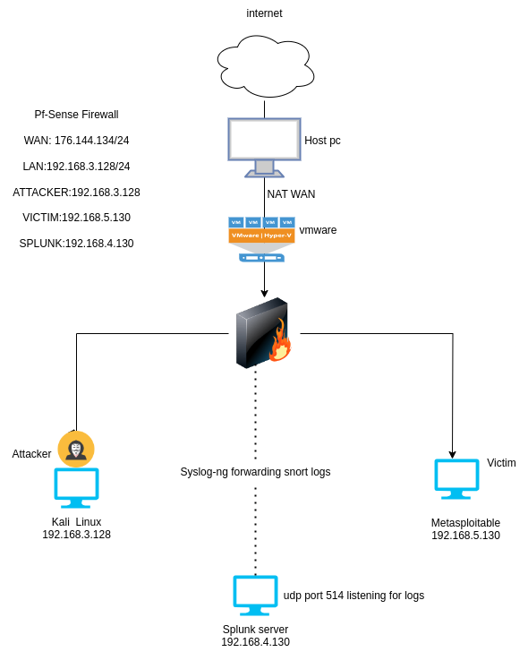
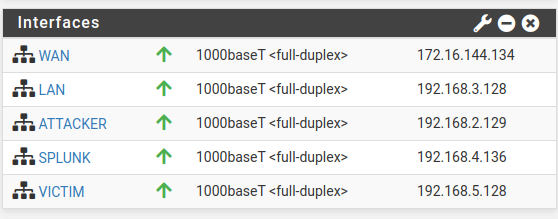
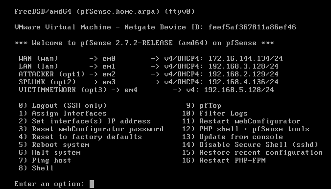

# Intrusion Detection HOME-LAB Setup on VMware



This repository contains the configuration and setup instructions for my home intrusion detection lab, which is built using VMware virtualization technology. The lab aims to simulate network security monitoring using pfSense, Snort IDS, and Splunk for log analysis.

## Network Configuration

- **WAN:** 176.144.134/24
- **LAN:** 192.168.3.128/24
- **Attacker VM:** 192.168.3.128
- **Victim VM:** 192.168.5.130
- **Splunk Server:** 192.168.4.130

## Components Used

- **pfSense Firewall:** Acts as the network gateway and firewall.
- **Snort IDS:** Installed on pfSense to detect and alert on suspicious network activity.
- **Splunk:** Used for centralized log management and analysis.
- **VMware:** Virtualization platform used to host and manage the lab environment.

## Lab Setup Steps

### Setting up pfSense Firewall

1. **Download and Install pfSense:**
   - Download the pfSense ISO from the official website.
   - Install pfSense on a VMware virtual machine, configuring WAN and LAN interfaces.
     
      
     

2. **Configure Firewall Rules:**
   - Access the pfSense web interface (default IP: 192.168.1.1).
   - Create firewall rules to allow/deny traffic between WAN, LAN, and other networks.

3. **Install and Configure Snort:**
   - Navigate to the pfSense Package Manager.
   - Install the Snort package and configure it to monitor traffic on specified interfaces.

### Configuring Snort IDS

1. **Snort Rules and Alerts:**
   - Customize Snort rules to detect specific threats.
   - Configure alerts to trigger on suspicious network activity.

2. **Testing Snort:**
   - Generate test traffic (e.g., using Kali Linux as an attacker) to trigger Snort alerts.
   - Verify Snort's functionality by checking alert logs.


### Setting up syslog-ng for Log Forwarding

1. **Install syslog-ng:**
   - SSH into pfSense and install syslog-ng using pkg package manager.

2. **Configure syslog-ng:**
   - Edit syslog-ng configuration file to forward Snort logs to the Splunk Server.

   Edit configuration (/usr/local/etc/syslog-ng.conf)


2. **Configure syslog-ng:**
   - Edit syslog-ng configuration file to forward Snort logs to the Splunk Server.

   Edit configuration (/usr/local/etc/syslog-ng.conf)


```
# Define the source to read Snort alerts from the file
source s_snort_alert {
  file("/var/log/snort/snort_em43181/alert" follow_freq(1) flags(no-parse));
};

# Define the destination to send logs to Splunk
destination d_splunk {
  udp("192.168.4.130" port(514));
};

# Define the log path for forwarding
log {
  source(s_snort_alert);
  destination(d_splunk);
};


```


### Setting up Splunk for Log Analysis

1. **Install Splunk:**
- Download and install Splunk on a separate VM (e.g., Splunk Server).

2. **Configure Splunk to Receive Logs:**
- Configure Splunk to listen on the configured syslog-ng port (514/tcp) for incoming logs.


## Conclusion

This setup provides a practical environment for learning and practicing intrusion detection techniques using pfSense, Snort IDS, syslog-ng, and Splunk. By following these steps, you can effectively simulate and analyze network security incidents in a controlled VMware environment.


